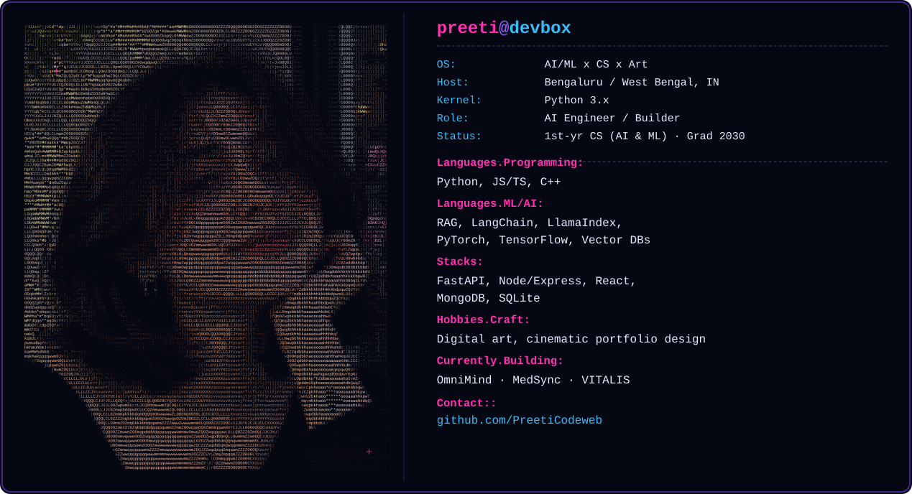
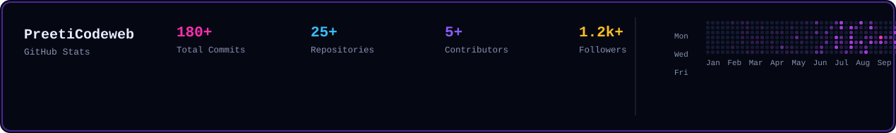

  

**AI Engineer &nbsp;·&nbsp; Software Developer &nbsp;·&nbsp; Product Thinker &nbsp;·&nbsp; Artist**

First-year CS (AI & ML) student building in public across multiple products —
from RAG-based assistants to hospital-ops platforms — while learning the stack
one production system at a time.

 

 

## 🚀 What I'm Building

| Project | Description |
|---|---|
| 🧠 **OmniMind** | RAG-based AI knowledge assistant — Node/Express LLM backend, dual Anthropic/OpenAI providers, JWT auth, SSE streaming, MongoDB persistence |
| 🏥 **MedSync** | Hospital management platform — FastAPI + ChromaDB RAG + vanilla JS frontend |
| 💙 **VITALIS** | Hospital AI operations platform — React + TypeScript + Vite, dark command-center UI |
| 🎨 **Portfolio / Art Site** | Personal art gallery & cinematic e-commerce portfolio |

 

## 🛠 Tech Stack

 

 

## 📊 GitHub Stats

<!--
  Swap the static bar above for live, auto-updating cards whenever you're ready:

  
  
  
  
-->

 

### 📫 Let's Connect

 

